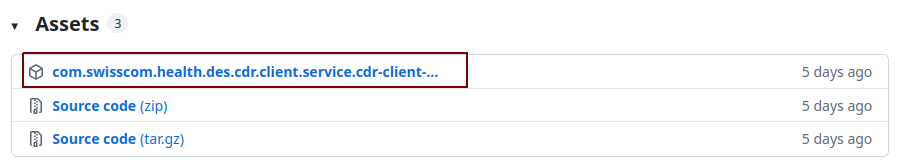
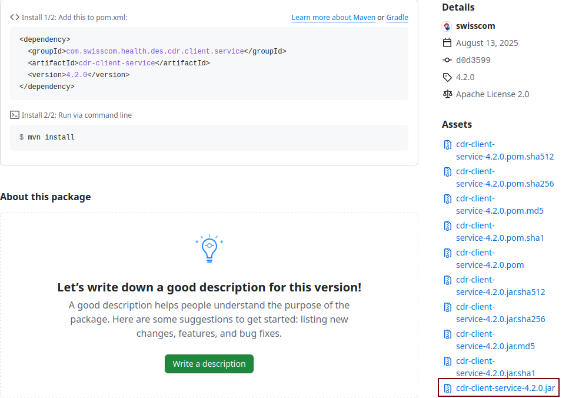

# CDR Client
The Swisscom Health Confidential Data Routing (CDR) Client

## Installation / Run the client
> Improvements for the installation are planned. For now, the client is only available as a jar file with manual steps 
> required for the installation.

Pre-Requirements:
* Java 17 (or higher) installed

Go to the [releases](https://github.com/swisscom/cdr-client/releases) github page and click on the maven assets for the newest release:

Download the jar file:

Place a file named application-customer.yaml in the same directory as the jar file.
The application-customer.yaml file should contain the configuration for the client. 
An example can be found [here](#application-customer-yaml-example).

Open a terminal and navigate to the directory where the jar file is located.
Run the following command to start the client (check the jar name and replace it in the command or rename the jar 
itself):
> The -D parameters need to be placed before the "-jar cdr-client.jar".<p>
> The quotes are necessary for Windows, but not for Unix systems
```shell
java "-Dspring.profiles.active=customer" "-Dspring.config.additional-location=./application-customer.yaml" -jar cdr-client.jar
```

Check that no error messages are present in the terminal (or have a look at the "cdr-client.log" file that is created 
in the same folder as you've placed tha jar file) and that the client is running.

Configure an OS appropriate service to run the client as a background service.

## API

Document downloads from the CDR API are triggered by a scheduler. Document uploads are triggered by file system 
events (if available) and a scheduler.

### Functionality
For each defined connector the CDR Client calls the CDR API endpoints for document download and document upload.

Optionally the client can be configured to renew its client credential on startup.

#### Client Credential Renewal

The client can be configured to renew its credential on startup. The default behavior is to not renew the credential.

Credential renewal only works if the client credential is configured in a properties or YAML file. If the client 
detects multiple sources (system property, environment variable, etc.) for the credential or the source is not of 
either of the two file types, then credential renewal won't be attempted. Likewise, if the user that runs the client 
process does not have write permissions on the file.

During a successful client credential renewal all pre-existing client credentials are deleted. So, if you source the 
client credential from a secure location (Hashicorp Vault, Azure Keyvault, etc., like you should) as part of your 
deployment process, then, obviously, you should not enable credential renewal. A re-deployment would restore a 
previous  credential that is no longer valid, and you would be locked out of the client account until you manually  
re-create a credential on the CDR website.

#### Document Download

For each connector one file after the other is pulled. Each file is written into a temporary folder defined as 'local-folder'.
The file is named after the received 'cdr-document-uuid' header that is a unique identifier created by the CDR API.
After saving the file to the temporary folder, a delete request for the given 'cdr-document-uuid' is sent to the CDR API.
After successfully deleting the file in the CDR API, the file is moved to the connector defined 'target-folder'.

The temporary folders need to be monitored make sure that no files get stranded there (should only happen if the move
to the destination folder is failing).

#### Document Upload

Document upload uses a combination of directory polling and event driven uploads. The polling process inspects the 
contents of every source folder at the configured interval and uploads all `.xml` files it finds to the CDR API. The 
event driven process listens for filesystem events from the same directories and uploads all `.xml` files as they 
are created. The two approaches are combined so

* at the start of the client all files are uploaded that might have arrived while the client was not running
* folders on (remote) filesystems that do not support filesystem events can be used as source folders

If the filesystem that hosts a source folder supports filesystem events, then the polling process normally won't find 
any files to process and immediately goes back to sleep. If the polling process wakes up right at the moment a new file 
arrives, it might happen that both processes pick up the same file for processing. However, only one of the two will 
continue to process the file, depending on which one is first to register the file for processing.

After the file is successfully uploaded it is either deleted or archived, depending on the connector configuration.
If the upload failed with a response code of 4xx the file will be appended with '.error' and an additional file with
the same name as the file sent, but with
the extension '.log', will be created and the received response body will be saved to this file.
If the upload failed with a response code of 5xx the file will be retried indefinitely, assuming the root cause is 
an infrastructure issue that will ultimately be resolved (and uploading another file would fail too, for the same 
reason). See retry-delay in the [application-client.yaml](./src/main/resources/config/application-client.yaml) file.

## Local development
To test some use cases there is a [docker-compose.yaml](./docker-compose/docker-compose.yaml) with wiremock that 
simulates the CDR API. Run with ```docker-compose down && docker-compose up --build```.

If you want to work with a deployed CDR API you need to change the [application-dev.yaml](./src/main/resources/config/application-dev.yaml)

Set the following spring profile to active: dev

Following environment variables can be set (to override their `dev` profile defaults):

| Variable                 | Default Value                |
|--------------------------|------------------------------|
| CDR_CLIENT_LOCAL_FOLDER  | $HOME/Documents/cdr/inflight |
| CDR_CLIENT_TARGET_FOLDER | $HOME/Documents/cdr/target   |
| CDR_CLIENT_SOURCE_FOLDER | $HOME/Documents/cdr/source   |
| CDR_B2C_TENANT_ID        | test-tenant-client-id        |
| CDR_CLIENT_ID            | fake-id                      |
| CDR_CLIENT_SECRET        | Placeholder_dummy            |

The application JRE has to be started with the following system properties:

* `-Djdk.net.hosts.file=src/main/resources/msal4j_hosts`
* `-Djavax.net.ssl.trustStore=src/main/resources/caddy_truststore.p12`
* `-Djavax.net.ssl.trustStorePassword=changeit`

The first property sets a custom hosts file to resolve external servers that MSAL4J has hardcoded as valid IdPs and 
redirect them to `localhost`. The other properties are used to make the JRE trust the SSL certificate presented by the  
[caddy proxy](https://caddyserver.com/) server that we use to impersonate those servers. 

## Application Plugin
To create scripts to run the application locally one needs to run following gradle cmd: ```gradlew installDist```

This creates a folder ```build/install/cdr-client``` with scripts for windows and unix servers in the ```bin``` folder.

To run the application locally one can call ```./build/install/cdr-client/bin/cdr-client```. It is required to have a ```application-customer.yaml``` and link it by adding following command line: ```JVM_OPTS="-Dspring.config.additional-location=./application-customer.yaml"```.
With a configuration that looks like [this](#application-customer-yaml-example).

## Running the Jar
If the provided jar should be run directly, the following command can be used:
```java -jar cdr-client.jar```
The jar can be found in build/libs.

Following environment variables need to be present (and correctly configured) so that the application can start successfully:
```
SPRING_CONFIG_ADDITIONAL_LOCATION={{ cdr_client_dir }}/config/application-customer.yaml"
LOGGING_FILE_NAME={{ cdr_client_dir }}/logs/cdr-client.log"
```
The LOGGING_FILE_NAME is just so that the log file is not auto created where the jar is run from.

See [Application Plugin](#application-plugin) regarding the content of the application-customer.yaml

## application-customer yaml example
```
client:
  local-folder: /tmp/download/in-flight # temporary folder for files that are currently downloaded from CDR API
  idp-credentials:
    tenant-id: swisscom-health-tenant-id # provided by Swisscom Health
    client-id: my-client-id # Self-service on CDR website
    client-secret: my-secret # Self-service on CDR website
    renew-credential: false
    max-credential-age: 365d
    last-credential-renewal-time: 2025-06-05T14:01:42Z
  cdr-api:
    host: cdr.health.swisscom.ch
  retry-delay: 
    - 1s # delay on first retry
    - 2s
    - 8s
    - 32s
    - 10m # delay after fifth retry and all following retries
  file-busy-test-strategy: never_busy # valid values are `never_busy` and `file_size_changed`
  customer:
    - connector-id: 8000000000000 # provided by Swisscom Health
      content-type: application/forumdatenaustausch+xml;charset=UTF-8
      target-folder: /tmp/download/test/8000000000000
      source-folder: /tmp/upload/test/8000000000000
      mode: test
    - connector-id: 8000000000000 # provided by Swisscom Health
      content-type: application/forumdatenaustausch+xml;charset=UTF-8
      target-folder: /tmp/download/8000000000000
      source-folder: /tmp/upload/8000000000000
      mode: production
```

Some information can also be set as environment variables. See [application-client.yaml](./src/main/resources/config/application-client.yaml) for variable names.

If the host is not set to production, but to stg instead, then the CDR_CLIENT_SCOPE_PREFIX environment variable needs to be set to "tst.".
